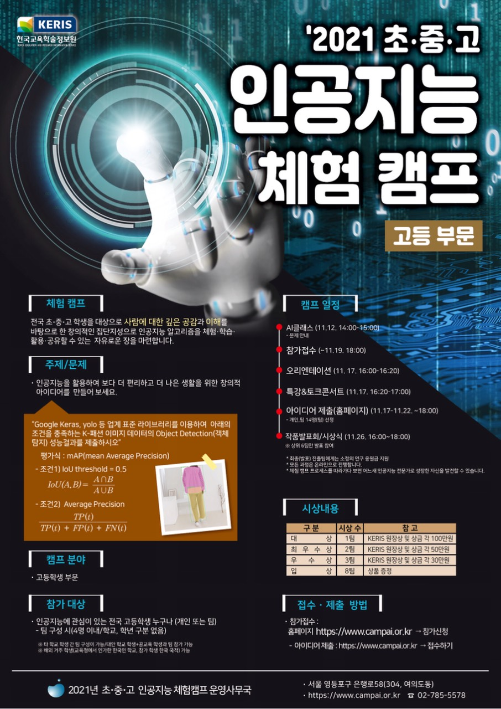
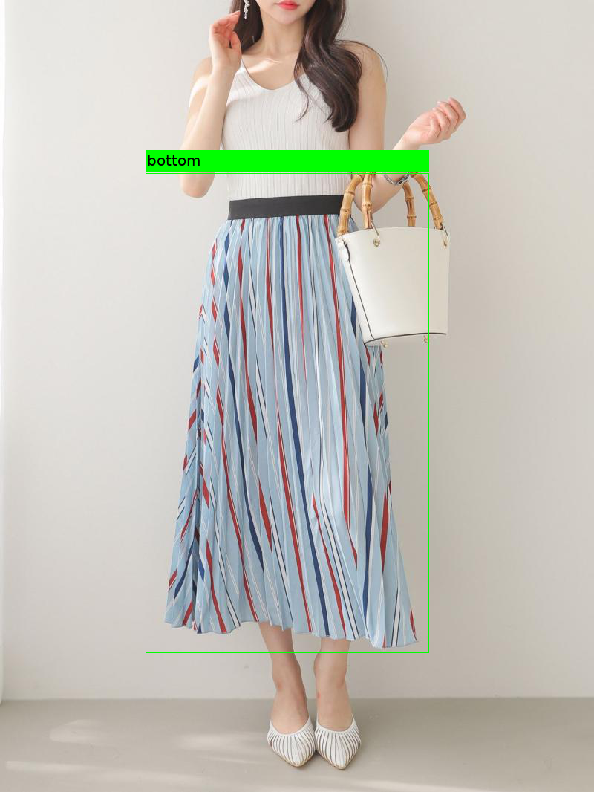

# AiCamp Baseline

# Task
- 이미지에서 상의, 하의, 원피스, 아우터의 바운딩 박스를 검출하는 Task

# 규정
### 데이터
- 외부 데이터 학습 불가
- 제출용으로 제공된 test 이미지는 어떠한 형태로도 학습 불가
- 제공된 train, valid set은 예시 구분으로 개인이 구분을 변경하여 학습 가능

### 모델
- 자유롭게 사용 가능
    - 단, pre-trained 모델은 논문이 출판된 official 모델만 사용 가능
- 예제 코드로 EfficientDet 모델 학습 과정이 제공됨 (아래 참조)

### 평가
- MS COCO 방식과 같은 mAP@[0.50:0.95] 를 평가 metric으로 사용
- json 형식의 결과 파일을 메일로 제출하여 평가 daily update (서강대 황문기 교수: mkhwang@sogang.ac.kr, 010-7685-3889)
    - 대회 기간 내에는 Test set `일부`로 평가
    - 대회 마감 후 Test set `전부`로 평가한 최종 순위 공개
    - 최종 순위로 수상 팀 결정
- 최종 제출에는 학습 코드도 포함(데이터 split 변경시 데이터 링크 제출)
    - 결과가 재현되지 않을 시 수상이 취소될 수 있음

## Dataset
- [google drive](https://drive.google.com/drive/folders/16_P1QWnChrGbRG1FViG-nHYESMcyH839?usp=sharing)
    - Fashion2021 폴더에서 마우스 우버튼을 눌러 자신의 google drive에 바로가기 추가 후 사용
## Train & Test
- [colab example](https://colab.research.google.com/drive/1aWAhs6xxHeSe4ZgPyXABk9U_w6G6-oBL?usp=sharing)
    - [colab 런타임 연결 끊김 방지](https://teddylee777.github.io/colab/google-colab-런타임-연결끊김방지)
- colab이 아닌 터미널 사용시 Repository를 clone하여 설치(`pip install .`)한 뒤 `train.py`, `validate.py` 를 사용

## References
- [AI 허브 K-Fashion](https://aihub.or.kr/aidata/7988)
- [EfficientDet (PyTorch)](https://github.com/rwightman/efficientdet-pytorch)
- [EfficientDet 논문](https://arxiv.org/abs/1911.09070)
